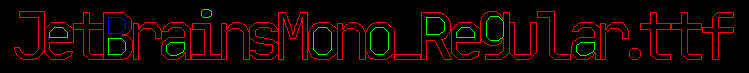
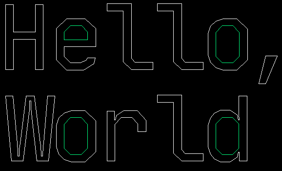
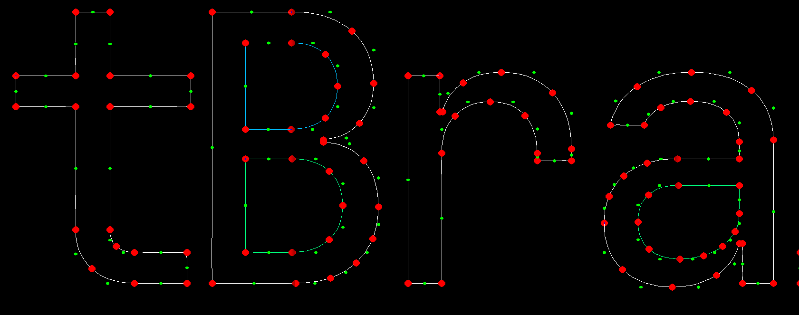

# ttf-parser

### Personal project to learn ttf parsing in Rust

(Using JetBrainsMono-Regular to test)

1. Initial rendering multiple glyphs on canvas

    
- Monospace font looks alright here, although still need to adjust heights..

2. Ascending height fixed, better spacing (for mono)

    

2. Descending heights fixed

    

    

3. Using Bezier Curves

    

    

## TODO
- Fix some glyph data showing weird (space is showing as 'H')
- Handle compound glyphs
- Improve spacing
- Render glyphs totally (filling inside)
- Fix some strange aliasing issues when zoomed out (could be rasterization issue)