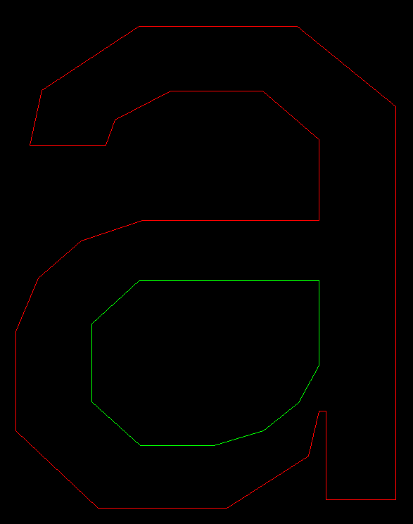

# ttf-parser

### Personal project to learn ttf parsing in Rust

(Using JetBrainsMono-Regular to test)

## TODO
- Map charCode to glyph index
- Render outline using bezier data
- Render multiple glyphs (using spacing data)
- Render glyphs totally (filling inside)